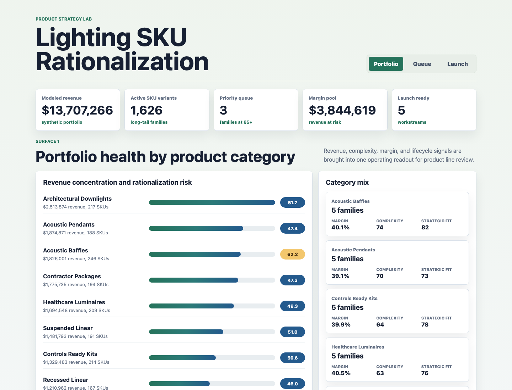
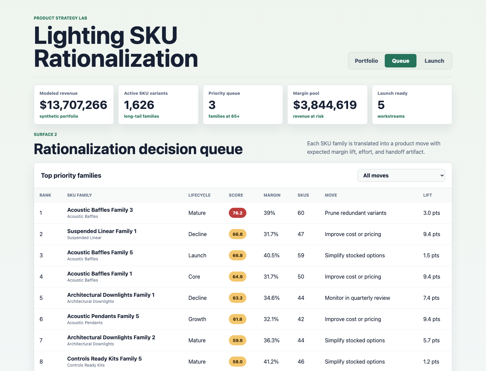
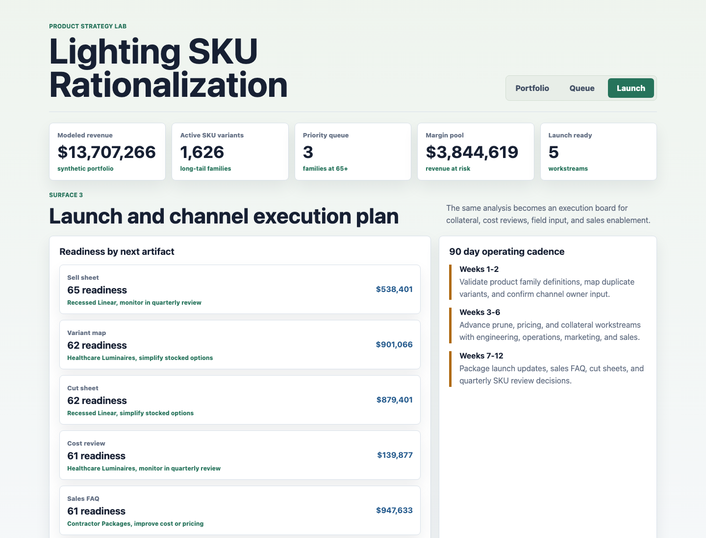

# Lighting SKU Rationalization Product Strategy Lab

This portfolio artifact is a product strategy decision lab for a residential and architectural lighting manufacturer with a high-SKU product portfolio. It shows how an associate product manager can turn messy product line signals into rationalization, margin, collateral, and launch execution decisions.

The project is intentionally more than a dashboard. It connects synthetic source-style operating data, a transparent scoring model, a prioritized product queue, and cross-functional next actions for product, sales, engineering, operations, and marketing review.

## Screenshots



Caption: The portfolio health surface summarizes modeled revenue, active SKU variants, margin pool, and category-level rationalization risk so a product manager can see where SKU complexity and commercial value overlap.



Caption: The rationalization queue ranks SKU families by a weighted decision score and translates each family into a specific move such as prune redundant variants, improve cost or pricing, simplify stocked options, or monitor.



Caption: The launch surface converts the analysis into a 90 day execution plan with next artifacts such as sell sheets, cut sheets, sales FAQs, field surveys, cost reviews, and variant maps.

## What The Artifact Demonstrates

- SKU rationalization analysis for a complex lighting portfolio.
- Revenue, margin, order velocity, quote activity, lead time, quality, certification, and channel-fit tradeoffs.
- Product line maintenance decisions that connect analysis to execution.
- Cross-functional thinking across engineering, marketing, industrial design, sales, and operations.
- Launch and channel readiness planning for product families that should be refreshed, simplified, or supported with better collateral.

## Data Strategy

All data in this repository is synthetic and does not represent any real company performance.

The synthetic structure is modeled on public-domain architectural lighting portfolio patterns: product categories, lifecycle stages, long-tail SKU variants, quote and sample activity, order velocity, gross margin, lead time, product complexity, certification burden, channel fit, strategic fit, and launch collateral needs.

Generated datasets:

- `data/entities.csv`: 40 SKU family records across recessed linear, suspended linear, architectural downlights, acoustic pendants, acoustic baffles, healthcare luminaires, contractor packages, and controls-ready kits.
- `data/daily_metrics.csv`: 7,200 SKU family-day rows with booked revenue, order count, margin, quality, lead time, and risk score.
- `data/source_events.csv`: 257 event rows covering sales asks, customer quotes, operational exceptions, engineering reviews, collateral gaps, and quality signals.
- `data/recommended_actions.csv`: 40 product action rows with recommended move, owner, effort, expected margin lift, revenue at risk, launch readiness, and next artifact.
- `analysis/outputs/priority_queue.csv`: the ranked queue used by the front-end artifact.

Synthetic generation assumptions:

- SKU complexity rises with variant count, certification count, configuration burden, and lead time.
- Rationalization priority increases when long-tail SKU count, low order velocity, margin gaps, quality drag, weak channel fit, and lead time risk overlap.
- Launch readiness increases when strategic fit and channel fit are strong and product complexity is lower.
- Margin lift is estimated from the gap between current modeled margin and a healthy target margin range.
- Revenue at risk is a planning proxy, not an actual loss estimate.

Regenerate the data and analysis outputs with:

```bash
python3 scripts/generate_synthetic_data.py
```

## Scoring Model

The rationalization score is a weighted index using:

- Active SKU count.
- Order velocity weakness.
- Gross margin gap.
- Product complexity.
- Lead time risk.
- Channel fit gap.
- Quality drag from modeled return rate.

The score is intentionally explainable. For this product management use case, a transparent weighted decision model is more useful than a black-box predictive model because the output needs to be defended in stakeholder review.

## How To Run

```bash
npm run start
```

Then open:

```text
http://127.0.0.1:5317
```

If that port is busy, run a standard static server on another port:

```bash
python3 -m http.server 4173
```

## Role Fit

This artifact maps directly to work expected from an associate product manager supporting product launches, SKU analysis, SKU rationalization, market research, profitability improvement, sales support, and product line maintenance. It demonstrates the ability to use Excel-style operating data, make product tradeoffs, and turn analysis into concrete cross-functional actions.

## Scope

This project does:

- Model a realistic SKU rationalization workflow using labeled synthetic data.
- Provide three different decision surfaces: portfolio health, rationalization queue, and launch execution.
- Document the data generation process and scoring logic.
- Produce stakeholder-ready recommendations that can be explained in an interview.

This project does not:

- Use confidential, internal, or real company performance data.
- Claim that the modeled revenue, margin, or SKU counts are actual results.
- Automate live product catalog changes.
- Replace commercial judgment from product, sales, engineering, operations, or marketing teams.
